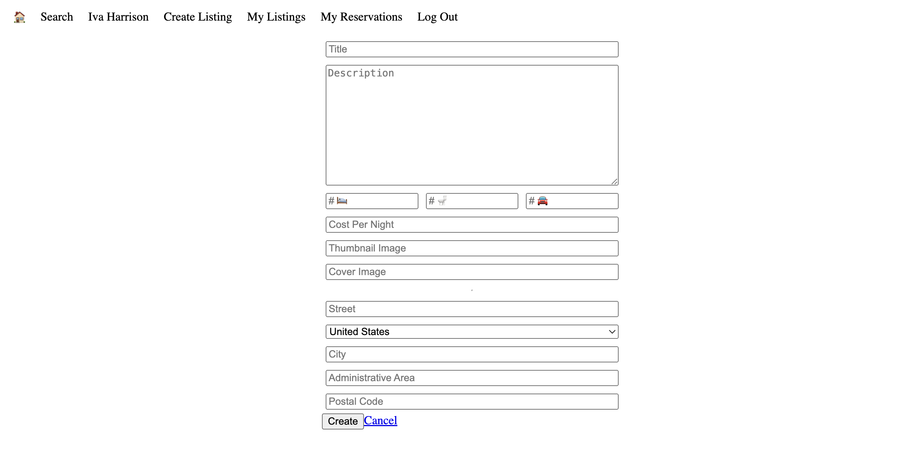

# LightBnB Project

A simple AirBnb clone that uses a server-side Javascript to display the information from queries to web pages via SQL queries.


## Getting Started

1. Clone this repository to your local machine.
2. Install dependencies using `npm install`.
    - You may need to have npx installed first. Use the `npm install -g npx` command.
3. Set up PostgreSQL database:
    - Create a new database named `lightbnb`.
4. Configure the database connection in the database.js file:
   - Open the `database.js` file. (located in LightBnb/LightBnB_WebApp/db/databse.js)
    - Modify the `pool` configuration to match your PostgreSQL database credentials.
  ```
  // database.js
  // Configure the database connection
    const pool = new Pool({
      user: 'your_database_user',
      password: 'your_database_password',
      host: 'localhost',
      database: 'lightbnb',
      port: 5432,
    });
  ```
5. Start the web server using the `npm run local` command.
6. Go to <http://localhost:3000/> in your browser.


## Dependencies

- bcrypt
- cookie-session
- Express
- Node.js
- pg

## Screenshots


